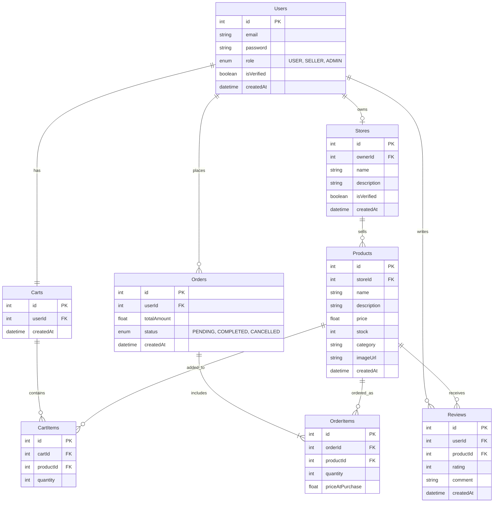

# Entity Relationship (ER) Diagram

```mermaid
erDiagram
    Users {
        int id PK
        string email
        string password
        enum role "USER, SELLER, ADMIN"
        boolean isVerified
        datetime createdAt
    }

    Stores {
        int id PK
        int ownerId FK
        string name
        string description
        boolean isVerified
        datetime createdAt
    }

    Products {
        int id PK
        int storeId FK
        string name
        string description
        float price
        int stock
        string category
        string imageUrl
        datetime createdAt
    }

    Carts {
        int id PK
        int userId FK
        datetime createdAt
    }

    CartItems {
        int id PK
        int cartId FK
        int productId FK
        int quantity
    }

    Orders {
        int id PK
        int userId FK
        float totalAmount
        enum status "PENDING, COMPLETED, CANCELLED"
        datetime createdAt
    }

    OrderItems {
        int id PK
        int orderId FK
        int productId FK
        int quantity
        float priceAtPurchase
    }

    Reviews {
        int id PK
        int userId FK
        int productId FK
        int rating
        string comment
        datetime createdAt
    }

    Users ||--o| Stores : "owns"
    Stores ||--o{ Products : "sells"
    Users ||--|| Carts : "has"
    Users ||--o{ Orders : "places"
    Users ||--o{ Reviews : "writes"

    Carts ||--o{ CartItems : "contains"
    Products ||--o{ CartItems : "added_to"

    Orders ||--|{ OrderItems : "includes"
    Products ||--o{ OrderItems : "ordered_as"

    Products ||--o{ Reviews : "receives"
```
