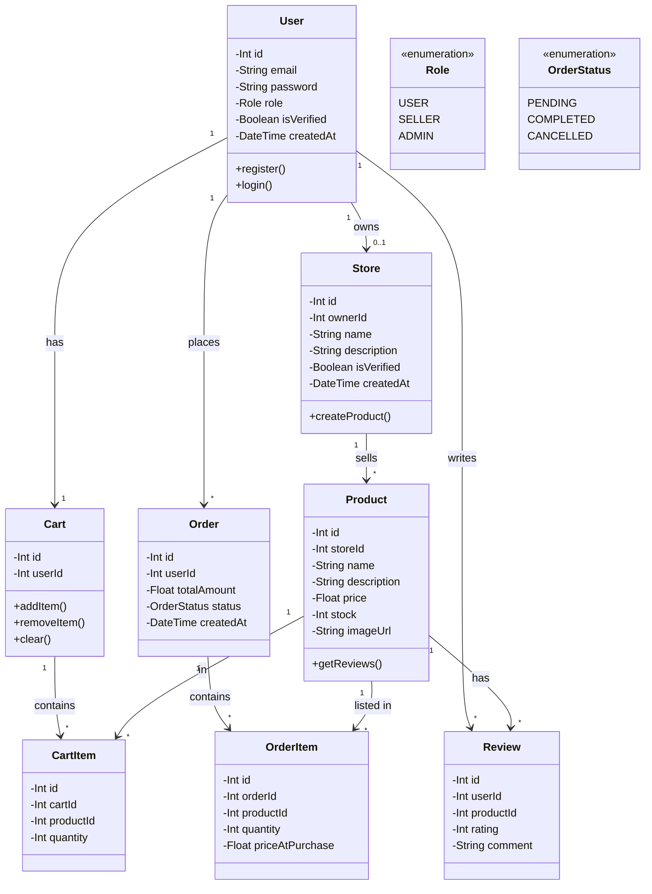

# Class Diagram

```mermaid
classDiagram
    class User {
        -Int id
        -String email
        -String password
        -Role role
        -Boolean isVerified
        -DateTime createdAt
        +register()
        +login()
    }

    class Store {
        -Int id
        -Int ownerId
        -String name
        -String description
        -Boolean isVerified
        -DateTime createdAt
        +createProduct()
    }

    class Product {
        -Int id
        -Int storeId
        -String name
        -String description
        -Float price
        -Int stock
        -String imageUrl
        +getReviews()
    }

    class Cart {
        -Int id
        -Int userId
        +addItem()
        +removeItem()
        +clear()
    }

    class CartItem {
        -Int id
        -Int cartId
        -Int productId
        -Int quantity
    }

    class Order {
        -Int id
        -Int userId
        -Float totalAmount
        -OrderStatus status
        -DateTime createdAt
    }

    class OrderItem {
        -Int id
        -Int orderId
        -Int productId
        -Int quantity
        -Float priceAtPurchase
    }

    class Review {
        -Int id
        -Int userId
        -Int productId
        -Int rating
        -String comment
    }

    %% Relationships
    User "1" --> "0..1" Store : owns
    Store "1" --> "*" Product : sells
    User "1" --> "1" Cart : has
    Cart "1" --> "*" CartItem : contains
    Product "1" --> "*" CartItem : in
    User "1" --> "*" Order : places
    Order "1" --> "*" OrderItem : contains
    Product "1" --> "*" OrderItem : listed in
    User "1" --> "*" Review : writes
    Product "1" --> "*" Review : has

    %% Enumerations
    class Role {
        <<enumeration>>
        USER
        SELLER
        ADMIN
    }

    class OrderStatus {
        <<enumeration>>
        PENDING
        COMPLETED
        CANCELLED
    }
```
