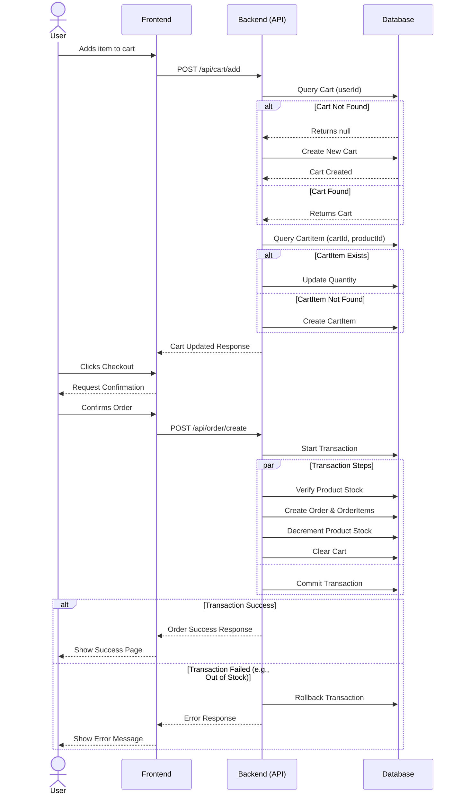

# Sequence Diagram - Checkout Flow

```mermaid
sequenceDiagram
    actor User
    participant Frontend
    participant API as Backend (API)
    participant Database

    User->>Frontend: Adds item to cart
    Frontend->>API: POST /api/cart/add
    API->>Database: Query Cart (userId)
    alt Cart Not Found
        Database-->>API: Returns null
        API->>Database: Create New Cart
        Database-->>API: Cart Created
    else Cart Found
        Database-->>API: Returns Cart
    end
    API->>Database: Query CartItem (cartId, productId)
    alt CartItem Exists
        API->>Database: Update Quantity
    else CartItem Not Found
        API->>Database: Create CartItem
    end
    API-->>Frontend: Cart Updated Response

    User->>Frontend: Clicks Checkout
    Frontend-->>User: Request Confirmation
    User->>Frontend: Confirms Order
    Frontend->>API: POST /api/order/create

    API->>Database: Start Transaction
    par Transaction Steps
        API->>Database: Verify Product Stock
        API->>Database: Create Order & OrderItems
        API->>Database: Decrement Product Stock
        API->>Database: Clear Cart
    and
        API->>Database: Commit Transaction
    end

    alt Transaction Success
         API-->>Frontend: Order Success Response
         Frontend-->>User: Show Success Page
    else Transaction Failed (e.g., Out of Stock)
         API->>Database: Rollback Transaction
         API-->>Frontend: Error Response
         Frontend-->>User: Show Error Message
    end
```
