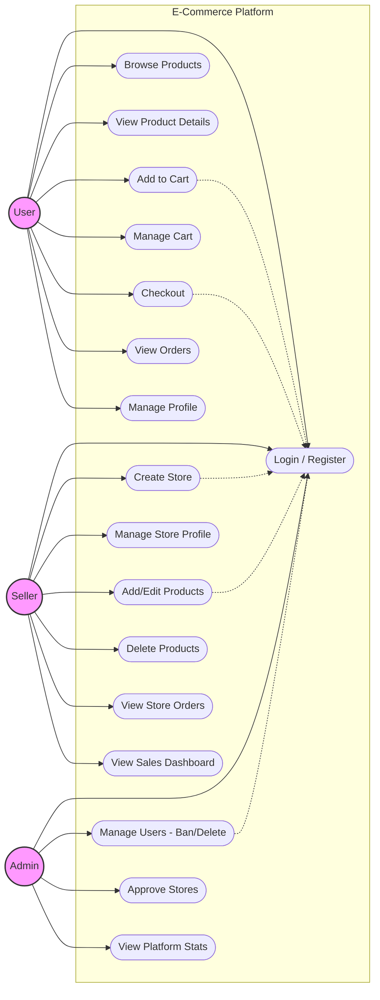

# Use Case Diagram

```mermaid
flowchart LR
    subgraph "E-Commerce Platform"
        direction TB
        %% Core Functionality
        UC1([Login / Register])
        UC2([Browse Products])
        UC3([View Product Details])
        UC4([Add to Cart])
        UC5([Manage Cart])
        UC6([Checkout])
        UC7([View Orders])
        UC8([Manage Profile])

        %% Seller Specific
        UC9([Create Store])
        UC10([Manage Store Profile])
        UC11([Add/Edit Products])
        UC12([Delete Products])
        UC13([View Store Orders])
        UC14([View Sales Dashboard])

        %% Admin Specific
        UC15([Manage Users - Ban/Delete])
        UC16([Approve Stores])
        UC17([View Platform Stats])
    end

    %% Actors
    U((User))
    S((Seller))
    A((Admin))

    %% User Connections
    U --> UC1
    U --> UC2
    U --> UC3
    U --> UC4
    U --> UC5
    U --> UC6
    U --> UC7
    U --> UC8

    %% Seller Connections
    S --> UC1
    S --> UC9
    S --> UC10
    S --> UC11
    S --> UC12
    S --> UC13
    S --> UC14

    %% Admin Connections
    A --> UC1
    A --> UC15
    A --> UC16
    A --> UC17

    %% Explicit Includes/Dependencies (Dotted Lines)
    UC4 -.-> UC1
    UC6 -.-> UC1
    UC9 -.-> UC1
    UC11 -.-> UC1
    UC15 -.-> UC1

    %% Styling
    classDef actor fill:#f9f,stroke:#333,stroke-width:2px;
    class U,S,A actor;
```
